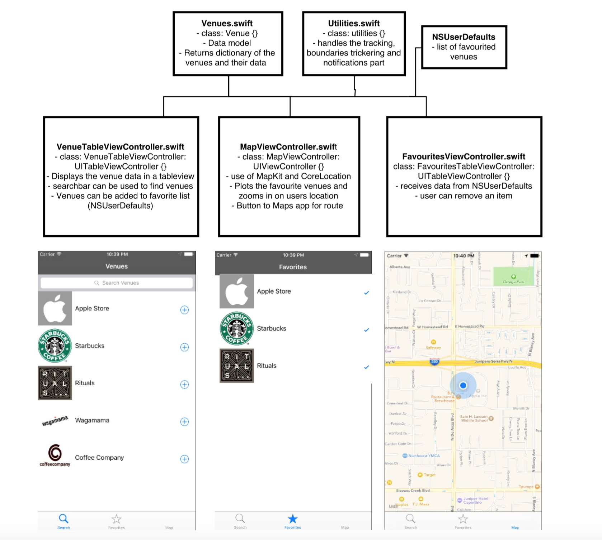
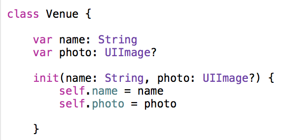

#Design Document "Nearby"

###Concept
Location based notification app which uses geofencing to monitor the location of the user and pushes a notification when the user is in radius of a venue he or she favorited. 

###Minimum viable product (MVP)
- Having a list of minimal 20 popular venues for a user to choose from. 
- User can search in this list and add a venue to favorites to monitor.
- Plotting of the favorite venues on the map with a boundary (region) radius.
- get a notifaction on iPhone when user enters the region of a favorited venue. 
- Option to switch to Apple Maps app for route.

###Framework

NOTE: UI is from the prototype, only changes when i have enough time to make it fancy. 

Frameworks/api's:
- MapKit
- CoreLocation

###Model classes

One model class for holding the name of the venues and their images.

