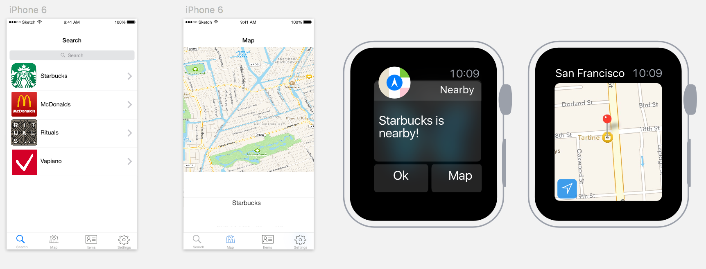

# ProgrammingProject

## Proposal "Nearby" 
###- Location based notifications 

### Problem
When you walk around in a city you dont know, but still want to be able to get to your favorite shops or restaurants (like eg Starbucks, Rituals etc) you can use various map apps to look them up and set a route planner. But usually you dont go to a new city to go to the shops you already know. Still it can be usefull to be aware that it is a possibility to eg drink a cup of coffee at starbucks while you are in the neighborhood. 

So that is the idea, location based notifications for custom locations chosen by the user. This is an iOS app with an extension for notifications on the Apple Watch. Why the watch? The Watch is meant for quick information showing. A notification for a location you may or may not want to visit is this kind of quick information. 

### Sketch

### Data
Gps Location from Core Location in Apple Map Kit, Locations of the items (NSuserdefaults), saved items (NSUserDefaults), Routes (MapKit(?)).

### Seperate parts of the application
The iOS app contains a Tab Bar with the following items: Search items, Map, Profile/saved Items and Settings. The user can search for location in the item list, this list will be set because this only is usefull for populair places. In the future this list is probably to long to scroll, so a search field will be provided. The map tab can be used for a more wide spread view of the neighborhood of the user. Further more there is a tab with the saved item list, in which the user can delete options. The settings will be used for some optional settings.

The Watch app contains custom notifications (optional: a glance and the app with a map and the route.) This way the user can just lift his or her arm and directly see the information. The optionals are optional because this will be very nice to have, with a single click the user can get the route to the location of choice provided by the notification, but this might be too much for 3 weeks. In week 4 I'll have to evaluate if there is enough time for the extension.

### Platform and api's
Ofcourse Xcode will be used, in xcode there is a built in Watchkit extension for building the watch app. The Apple Maps api (developers kit) will be used. Maybe a solution with iBeacons? the use of Apple Push Notification service (APN) which requires a certificate. 

### Potentional problems
The map api: getting the gps locations of the user for a radius around the saved locations. getting familiar with the WatckKit. 

### Similar applications
* Apple's reminder app voor location based reminders and notifications
* Facebook's nearby friends alert system
* EventPilot, location based notification app developed for events (Beacons and gps adress)
* iOS9 nearby siri suggestions

	 

