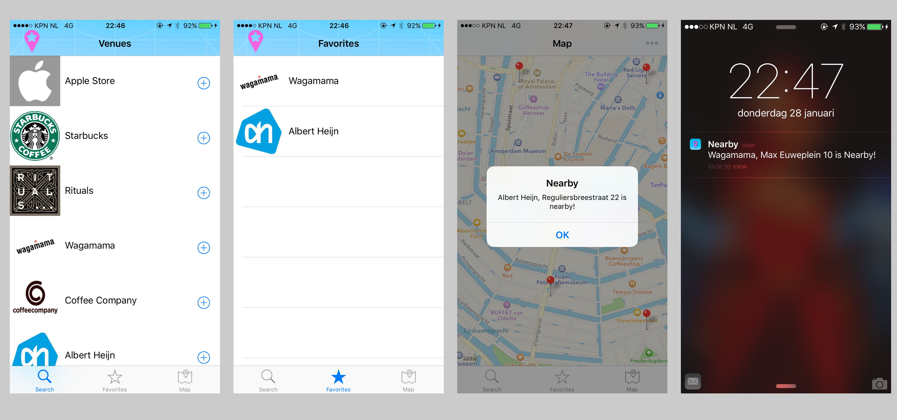

# ProgrammingProject

## Nearby
###- Location based notifications 

### Intro
When you walk around in a city you dont know, but still want to be able to get to your favorite shops or restaurants (like eg Starbucks, Rituals etc) you can use various map apps to look them up and set a route planner. But usually you dont go to a new city to go to the shops you already know. Still it can be usefull to be aware that it is a possibility to eg drink a cup of coffee at starbucks while you are in the neighborhood. 

So that is the idea, location based notifications for custom locations chosen by the user. The user gets a notification when he or she is in 200m of a favorite venue, this notification is ofcourse also received at the user's Apple Watch (if she or she has one) this way it only requires to lift the arm to see whats up.

### Sreenshots 

### External use of:

Logo's: Google image search

App Icon: Copyright Yaleesa Borgman & Nathalie van der Veen

Code: http://www.raywenderlich.com/95014/geofencing-ios-swift
Code: http://sweettutos.com/2015/04/24/swift-mapkit-tutorial-series-how-to-search-a-place-address-or-poi-in-the-map/
Code: http://www.raywenderlich.com/90971/introduction-mapkit-swift-tutorial
Code: http://stackoverflow.com/questions/30063986/swift-directions-to-selected-annotation-from-current-location-in-maps

	 

